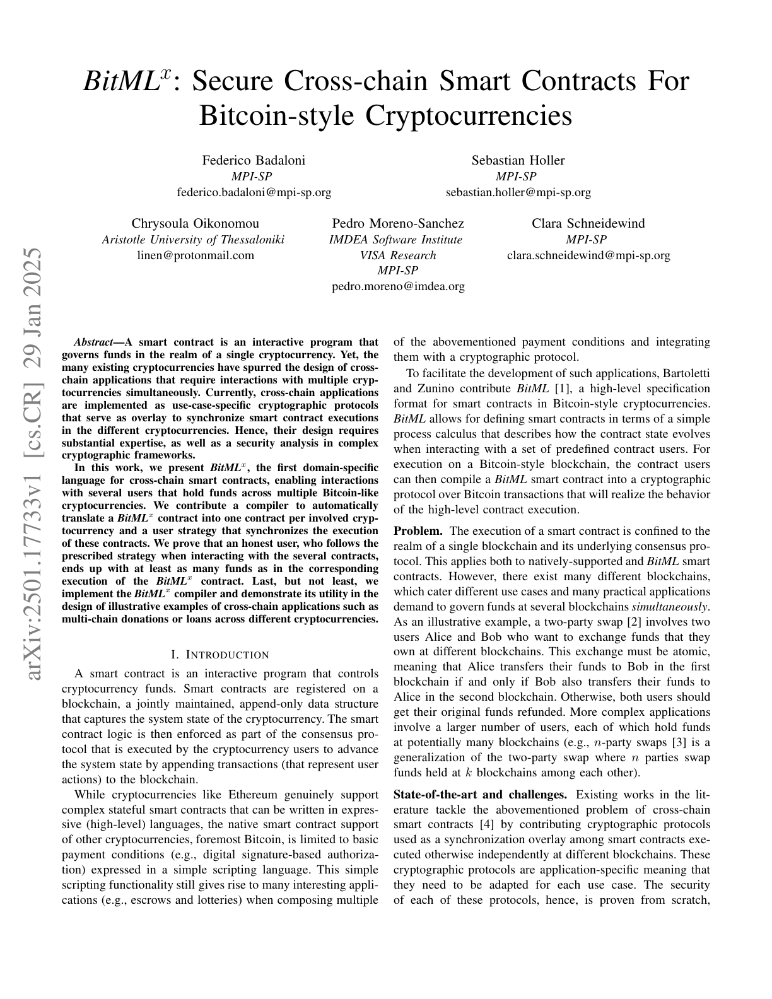
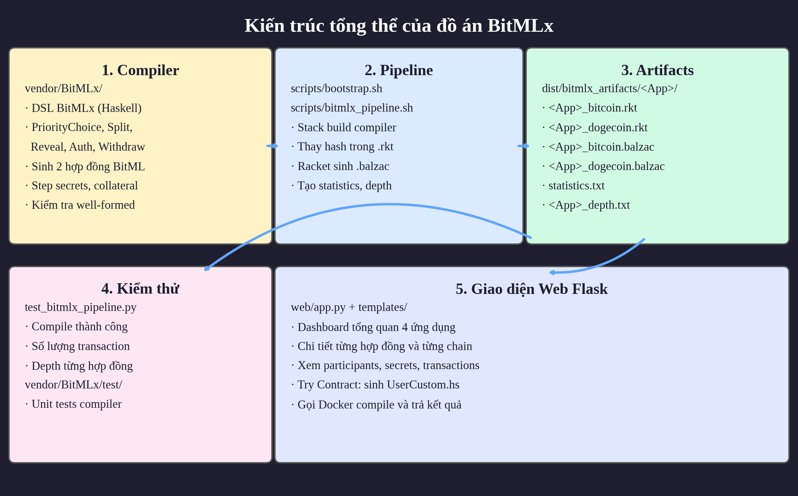
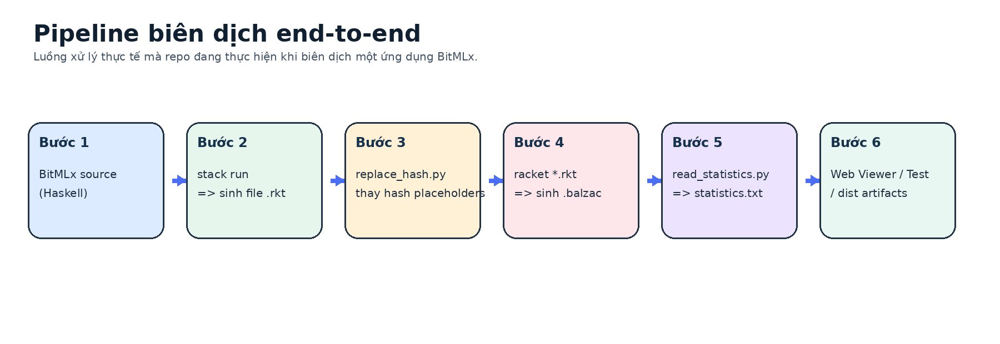
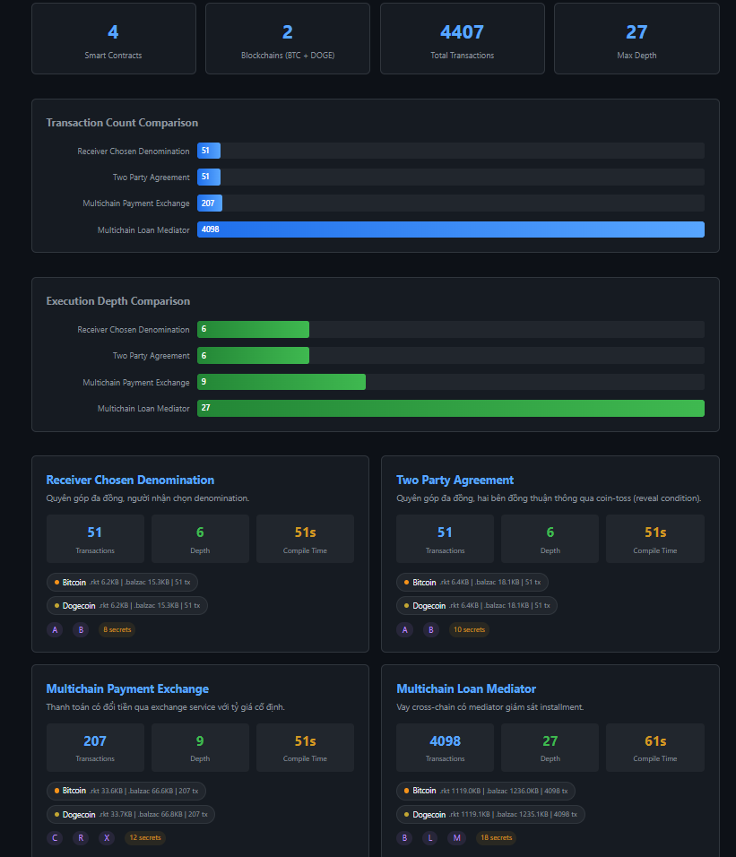
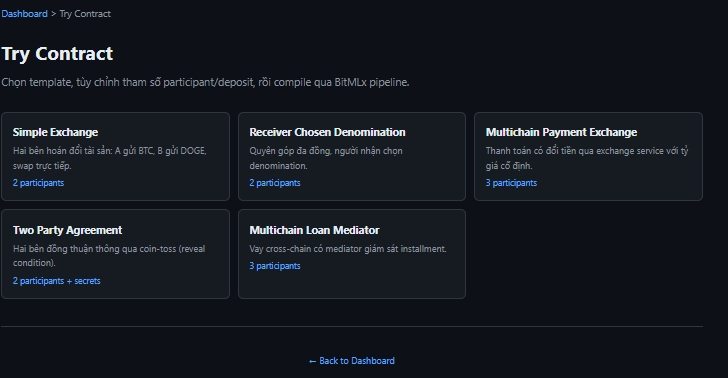
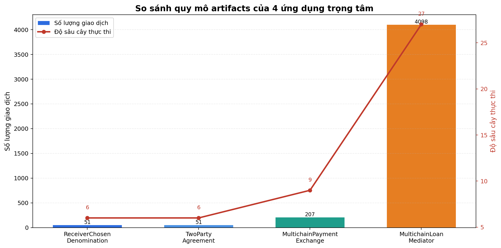

# TRIỂN KHAI ỨNG DỤNG SMART CONTRACT CROSS-CHAIN THEO BITMLX/BITML TOOLCHAIN

## Thông tin chung

| Mục | Nội dung |
|---|---|
| Tên đề tài | Triển khai ứng dụng smart contract cross-chain theo BitMLx/BitML toolchain trên mô hình UTXO |
| Sinh viên thực hiện | Ngô Vinh Huy, Nguyễn Gia Linh |
| Mã số sinh viên | 22520556, 22520768 |
| Lớp | NT547.Q21.ANTT |
| Mã nguồn | [`BitMLx`](https://github.com/sampleit533/BitMLx/) |
| Công cụ chính | Haskell, Racket, Python, Flask, Docker, Makefile, pytest |

## Mục lục

1. Giới thiệu tổng quan
2. Bài toán và động cơ thực hiện đồ án
3. Cơ sở lý thuyết
4. Mục tiêu và phạm vi của đồ án
5. Tổng quan kiến trúc hệ thống
6. Cấu trúc mã nguồn của repository
7. Phân tích chi tiết mã nguồn compiler
8. Pipeline biên dịch BitMLx/BitML end-to-end
9. Phân tích chi tiết 4 ứng dụng smart contract cross-chain
10. Ứng dụng web BitMLx Artifacts Viewer
11. Chức năng Try Contract
12. Hệ thống kiểm thử và xác minh kết quả
13. Kết quả artifacts và số liệu thống kê
14. Đánh giá ưu điểm, hạn chế và hướng phát triển
15. Hướng dẫn chạy chương trình

---

## 1. Giới thiệu tổng quan

Đồ án này xây dựng một hệ thống phục vụ việc đặc tả, biên dịch, kiểm thử và trực quan hóa các smart contract cross-chain trên các blockchain kiểu Bitcoin, cụ thể là Bitcoin và Dogecoin. Nền tảng trung tâm của đồ án là BitMLx, một ngôn ngữ đặc tả hợp đồng thông minh cross-chain ở mức cao. Từ một đặc tả BitMLx duy nhất, hệ thống có khả năng sinh ra hai hợp đồng BitML tương ứng cho hai blockchain đích, sau đó tiếp tục biên dịch các hợp đồng này thành artifacts ở mức giao dịch UTXO.

Điểm nổi bật của đồ án là repository không chỉ chứa mã nguồn compiler hoặc một vài ví dụ minh họa đơn lẻ. Thay vào đó, repository đã được tổ chức thành một hệ thống hoàn chỉnh gồm nhiều lớp: compiler, pipeline tự động, Docker, bộ test, artifacts đã biên dịch sẵn và giao diện web để trực quan hóa kết quả. Nhờ đó, người dùng có thể chạy lại quá trình biên dịch, kiểm chứng đầu ra, xem kết quả trên giao diện web và thử tạo hợp đồng mới dựa trên các template có sẵn.

Luồng xử lý tổng quát của hệ thống có thể tóm tắt như sau:

```text
BitMLx source code (Haskell embedded DSL)
        |
BitMLx compiler (stack run)
        |
Hai hợp đồng BitML dạng .rkt cho Bitcoin và Dogecoin
        |
replace_hash.py (thay hash placeholder)
        |
BitML compiler (racket *.rkt)
        |
Các file .balzac mô tả giao dịch UTXO
        |
Artifacts, thống kê, kiểm thử và giao diện web
```

<p align="center">
  
</p>
<p align="center"><em>Hình 1. Trang đầu tài liệu BitMLx gốc (arXiv:2501.17733v1)</em></p>

Hình trên được trích xuất từ file `bitmlx.pdf` trong repository. Đây là tài liệu nền tảng để giải thích cơ sở học thuật của đồ án.

---

## 2. Bài toán và động cơ thực hiện đồ án

Trong thực tế, tài sản số không chỉ tồn tại trên một blockchain duy nhất. Một người dùng có thể nắm giữ Bitcoin, một người khác có thể nắm giữ Dogecoin, và một ứng dụng tài chính phi tập trung có thể cần phối hợp nhiều loại tài sản trên nhiều blockchain khác nhau. Từ đó phát sinh nhu cầu xây dựng các hợp đồng cross-chain, tức là các hợp đồng có logic liên quan đồng thời đến nhiều blockchain.

Tuy nhiên, việc xây dựng smart contract cross-chain gặp nhiều khó khăn vì mỗi blockchain là một hệ thống độc lập. Giao dịch trên Bitcoin không tự động kéo theo giao dịch tương ứng trên Dogecoin. Nếu một giao thức cross-chain được thiết kế không cẩn thận, một bên có thể nhận được lợi ích trên chain này nhưng không thực hiện nghĩa vụ tương ứng trên chain khác.

Mô hình rủi ro chính mà đồ án quan tâm gồm:

- Giao dịch có thể bị trì hoãn.
- Giao dịch có thể bị sắp xếp lại thứ tự.
- Một bên có thể cố tình không thực hiện bước tiếp theo của giao thức.
- Một nhánh hoàn tiền hoặc hủy giao dịch có thể được ưu tiên trước khi nhánh chính hoàn tất.
- Các hành động trên hai chain có thể không được đồng bộ đúng thời điểm.

Nếu viết thủ công các giao thức này ở mức giao dịch UTXO, khả năng sai sót là rất cao. Vì vậy, đồ án lựa chọn hướng tiếp cận có hệ thống: dùng BitMLx để mô tả hợp đồng ở mức cao, sau đó để compiler tự động sinh ra các hợp đồng BitML và artifacts giao dịch tương ứng cho từng blockchain.

---

## 3. Cơ sở lý thuyết

### 3.1. Mô hình UTXO

Blockchain kiểu Bitcoin sử dụng mô hình UTXO, viết tắt của Unspent Transaction Output. Trong mô hình này, tài sản không được lưu như số dư trong một tài khoản toàn cục mà được biểu diễn bằng các đầu ra giao dịch chưa được chi tiêu. Khi muốn sử dụng tài sản, người dùng tạo giao dịch mới tham chiếu đến các UTXO cũ và tạo ra các UTXO mới.

Một UTXO thường đi kèm điều kiện chi tiêu. Một số điều kiện phổ biến gồm:

- Yêu cầu chữ ký số của một participant.
- Yêu cầu tiết lộ preimage của một giá trị băm.
- Yêu cầu chờ đến một mốc thời gian hoặc block height nhất định.
- Yêu cầu thỏa mãn một biểu thức logic cụ thể.

Vì đặc thù này, smart contract trên blockchain kiểu Bitcoin thường không phải là một chương trình chạy liên tục như trên mô hình account-based. Thay vào đó, logic hợp đồng được hiện thực thành một tập giao dịch và điều kiện chi tiêu được liên kết với nhau.

### 3.2. BitML

BitML là ngôn ngữ đặc tả smart contract cho blockchain kiểu Bitcoin. BitML giúp người lập trình mô tả logic hợp đồng ở mức cao hơn, sau đó compiler sẽ sinh ra các giao dịch tương ứng. Trong repository này, đầu ra BitML được biểu diễn dưới dạng file `.rkt` chạy với `#lang bitml`.

Sau khi có file `.rkt`, hệ thống tiếp tục dùng BitML compiler để sinh ra file `.balzac`. File `.balzac` là artifact mô tả các transaction, điều kiện chi tiêu và cấu trúc thực thi ở mức gần với mô hình UTXO hơn.

### 3.3. BitMLx

BitMLx mở rộng tư tưởng của BitML sang bối cảnh cross-chain. Thay vì viết riêng từng hợp đồng cho từng chain, người dùng mô tả một hợp đồng BitMLx duy nhất. Compiler BitMLx sẽ sinh ra một cặp hợp đồng BitML, một cho Bitcoin và một cho Dogecoin.

Các khái niệm quan trọng trong BitMLx gồm:

- `PriorityChoice (+>)`: biểu diễn lựa chọn có thứ tự ưu tiên giữa các nhánh thực thi.
- `Step secrets`: các bí mật gắn với từng bước hoặc từng nhánh của cây hợp đồng, dùng làm bằng chứng hành vi.
- `Compensation phase`: pha bồi thường cho bên trung thực nếu phát hiện hành vi lệch giữa các chain.
- `Collateral`: khoản tài sản khóa thêm nhằm đảm bảo khả năng bồi thường.
- `TimedPreconditions`: tập điều kiện ban đầu kèm thời điểm bắt đầu và khoảng thời gian chờ.

### 3.4. Ý nghĩa của cơ chế priority choice

Trong các giao thức cross-chain, không phải mọi nhánh thực thi đều có cùng mức ưu tiên. Một nhánh chính có thể là nhánh mong muốn, còn nhánh sau là nhánh fallback hoặc refund. BitMLx dùng toán tử `+>` để biểu diễn thứ tự đó. Ví dụ:

```haskell
contract =
    guardedContract1
    +> guardedContract2
    +> WithdrawAll pA
```

Ý nghĩa là hệ thống ưu tiên thực thi `guardedContract1`. Nếu nhánh này không thể thực hiện sau một khoảng thời gian, hệ thống chuyển sang `guardedContract2`. Nếu các nhánh ưu tiên đều không thực hiện được, fallback cuối cùng đảm bảo tài sản không bị khóa vĩnh viễn.

### 3.5. Ý nghĩa của step secrets

Step secrets là một trong những cơ chế quan trọng nhất của BitMLx. Mỗi participant có các secret tương ứng với từng bước trong cây hợp đồng. Khi một participant thực hiện một nhánh ưu tiên, họ phải reveal step secret tương ứng. Việc reveal này tạo ra dấu vết có thể kiểm chứng.

Nếu participant chỉ thực hiện hành động trên một chain nhưng không đồng bộ trên chain còn lại, step secret đã bị lộ có thể được dùng làm bằng chứng để kích hoạt pha bồi thường. Vì vậy, step secrets đóng vai trò vừa là điều kiện thực thi vừa là cơ chế truy trách nhiệm.

---

## 4. Mục tiêu và phạm vi của đồ án

Đồ án hướng đến các mục tiêu kỹ thuật sau:

- Biên dịch được các hợp đồng BitMLx sang BitML cho Bitcoin và Dogecoin.
- Sinh được artifacts `.rkt`, `.balzac`, `statistics.txt` và `*_depth.txt`.
- Chuẩn hóa môi trường build và test bằng Docker.
- Cung cấp các lệnh Makefile để người dùng chạy dễ dàng.
- Viết bộ integration test để kiểm tra pipeline đầu cuối.
- Xây dựng ứng dụng web để xem artifacts và thử biên dịch contract mới.

---

## 5. Tổng quan kiến trúc hệ thống

Hệ thống được tổ chức thành nhiều lớp có nhiệm vụ rõ ràng. Lớp đầu tiên là mã nguồn BitMLx và compiler Haskell. Lớp thứ hai là pipeline tự động để biên dịch và sinh artifacts. Lớp thứ ba là thư mục `dist/bitmlx_artifacts` chứa kết quả đã build sẵn. Lớp thứ tư gồm hệ thống kiểm thử và web app để quan sát, xác minh và tương tác với kết quả.

<p align="center">
  
</p>
<p align="center"><em>Hình 2. Kiến trúc tổng thể của đồ án</em></p>

Từ sơ đồ trên có thể thấy repository không chỉ là một compiler. Nó là một hệ sinh thái nhỏ gồm:

- Bộ đặc tả hợp đồng.
- Bộ biên dịch.
- Bộ script vận hành.
- Bộ artifacts đã sinh.
- Bộ test xác minh.
- Giao diện web.

---

## 6. Cấu trúc mã nguồn của repository

Repository có các thư mục và file quan trọng sau:

| Đường dẫn | Vai trò |
|---|---|
| `vendor/BitMLx/` | Mã nguồn BitMLx compiler viết bằng Haskell |
| `vendor/BitMLx/src/Syntax/BitMLx.hs` | Định nghĩa cú pháp BitMLx |
| `vendor/BitMLx/src/Compiler.hs` | Entry point biên dịch BitMLx sang BitML |
| `vendor/BitMLx/src/Compiler/Settings.hs` | Cấu hình compiler cho Bitcoin và Dogecoin |
| `vendor/BitMLx/src/Compiler/StepSecrets.hs` | Sinh step secrets cho từng participant và từng node |
| `vendor/BitMLx/src/Compiler/WellFormed.hs` | Kiểm tra tính hợp lệ của contract |
| `vendor/BitMLx/src/Compiler/Error.hs` | Định nghĩa các loại lỗi biên dịch |
| `vendor/BitMLx/src/Depth.hs` | Tính độ sâu cây thực thi |
| `vendor/BitMLx/app/Examples/` | Các hợp đồng mẫu viết bằng Haskell embedded DSL |
| `vendor/BitMLx/app/Main.hs` | Đăng ký và chạy các example |
| `vendor/BitMLx/replace_hash.py` | Thay thế hash placeholder bằng SHA-256 thực |
| `vendor/bitml-compiler/` | BitML compiler viết bằng Racket |
| `scripts/` | Các script bootstrap, compile, gom artifacts và chạy Docker |
| `tests/test_bitmlx_pipeline.py` | Integration test cho 4 ứng dụng chính |
| `web/app.py` | Backend Flask của ứng dụng web |
| `web/templates/` | Giao diện HTML cho dashboard, detail và try contract |
| `dist/bitmlx_artifacts/` | Artifacts đã biên dịch sẵn |
| `docker/Dockerfile` | Môi trường chạy tái lập |
| `Makefile` | Các lệnh chạy nhanh cho build, compile và test |

---

## 7. Phân tích chi tiết mã nguồn compiler

Phần này trình bày chi tiết mã nguồn Haskell của BitMLx compiler, giải thích từng module quan trọng kèm đoạn code thực tế.

### 7.1. Định nghĩa cú pháp BitMLx (`Syntax/BitMLx.hs`)

File `Syntax/BitMLx.hs` định nghĩa toàn bộ cấu trúc dữ liệu của ngôn ngữ BitMLx. Đây là nền tảng mà mọi contract được xây dựng trên đó.

**Kiểu dữ liệu `Contract`** biểu diễn hợp đồng chưa bị guard:

```haskell
data Contract where
    PriorityChoice :: GuardedContract -> Contract -> Contract
    Withdraw :: [((BCoins, DCoins), P)] -> Contract
    WithdrawAll :: P -> Contract
```

- `PriorityChoice` nhận một `GuardedContract` (nhánh ưu tiên) và một `Contract` (nhánh còn lại). Đây là cấu trúc đệ quy: nhánh phải có thể là một `PriorityChoice` khác, tạo thành chuỗi ưu tiên `D1 +> D2 +> ... +> fallback`.
- `Withdraw` phân bổ tài sản cho danh sách participants, mỗi phần tử là một tuple `((BTC, DOGE), participant)`.
- `WithdrawAll` rút toàn bộ tài sản cho một participant duy nhất.

**Kiểu dữ liệu `GuardedContract`** biểu diễn hợp đồng có điều kiện:

```haskell
data GuardedContract where
    Reveal :: [SName] -> Contract -> GuardedContract
    RevealIf :: [SName] -> Pred -> Contract -> GuardedContract
    Auth :: [P] -> GuardedContract -> GuardedContract
    Split :: [((BCoins, DCoins), Contract)] -> GuardedContract
    WithdrawD :: [((BCoins, DCoins), P)] -> GuardedContract
    WithdrawAllD :: P -> GuardedContract
```

- `Reveal` yêu cầu tiết lộ danh sách secret trước khi thực thi contract bên trong.
- `RevealIf` tương tự `Reveal` nhưng thêm một predicate logic phải thỏa mãn.
- `Auth` yêu cầu chữ ký xác nhận từ danh sách participants.
- `Split` chia tài sản thành nhiều nhánh con, mỗi nhánh có contract riêng.

**Các toán tử viết tắt** giúp code contract gần giống ký hiệu trong paper:

```haskell
-- Toán tử deposit: pA ! (1, 0) $ "A_deposit"
(!) :: P -> (BCoins, DCoins) -> DepositId -> Precondition
(p ! (bv, dv)) z = Deposit p (bv, dv) z

-- Toán tử authorization: [pA] &: WithdrawAllD pB
infix 3 &:
(&:) :: [P] -> GuardedContract -> GuardedContract
(&:) = Auth

-- Toán tử priority choice: guardedContract +> fallback
infixr 2 +>
(+>) :: GuardedContract -> Contract -> Contract
d +> c = PriorityChoice d c
```

Toán tử `+>` có fixity `infixr 2`, nghĩa là nó kết hợp phải. Nhờ vậy, `D1 +> D2 +> Withdraw [...]` được parse thành `PriorityChoice D1 (PriorityChoice D2 (Withdraw [...]))`, tạo chuỗi ưu tiên đúng thứ tự.

### 7.2. Entry point compiler (`Compiler.hs`)

File `Compiler.hs` chứa hàm `compileBitMLx`, là entry point duy nhất để biên dịch hợp đồng:

```haskell
compileBitMLx :: BitMLx.ContractAdvertisement
              -> Either CompilationError
                        (BitML.ContractAdvertisement BCoins,
                         BitML.ContractAdvertisement DCoins)
compileBitMLx bitmlxAdvertisement = do
    let btcSettings  = bitcoinSettings bitmlxAdvertisement
        dogeSettings = dogecoinSettings bitmlxAdvertisement
    btcAdvertisement  <- compileAdvertisement btcSettings bitmlxAdvertisement
    dogeAdvertisement <- compileAdvertisement dogeSettings bitmlxAdvertisement
    Right (btcAdvertisement, dogeAdvertisement)
```

Hàm này nhận một `ContractAdvertisement` BitMLx và trả về `Either` -- hoặc lỗi biên dịch, hoặc một cặp `ContractAdvertisement` BitML cho Bitcoin và Dogecoin. Cùng một hàm `compileAdvertisement` được gọi hai lần với hai bộ settings khác nhau. Sự khác biệt giữa hai lần gọi nằm ở trường `coinChooser`:

```haskell
-- Bitcoin: lấy phần tử thứ nhất của tuple (BTC, DOGE)
bitcoinSettings  = ... coinChooser = fst ...

-- Dogecoin: lấy phần tử thứ hai của tuple (BTC, DOGE)
dogecoinSettings = ... coinChooser = snd ...
```

Thiết kế này cho phép compiler tái sử dụng logic biên dịch cho cả hai chain mà không cần viết hai phiên bản riêng.

### 7.3. Cấu hình compiler (`Compiler/Settings.hs`)

Record `CompilerSettings` chứa toàn bộ trạng thái cần thiết cho quá trình biên dịch:

```haskell
data CompilerSettings c = CompilerSettings {
    targetBlockchain   :: String          -- "Bitcoin" hoặc "Dogecoin"
  , participants       :: [P]             -- danh sách participant
  , balance            :: c               -- tổng tài sản trên chain này
  , collateral         :: c               -- số tiền thế chấp
  , startSecrets       :: Map P SName     -- secret khởi động
  , stepSecretsByLabel :: Map NodeLabel (Map P SName) -- step secrets
  , elapseTime         :: Time            -- tham số thời gian
  , currentTime        :: Time            -- thời điểm hiện tại (tăng dần)
  , currentLabel       :: NodeLabel       -- nhãn vị trí trong cây
  , coinChooser        :: (BCoins, DCoins) -> c  -- hàm chọn coin
}
```

**Collateral** được tính từ số lượng participant:

```haskell
collateralFromPreconditions coinChooser preconditions =
    fromInteger (toInteger (n - 2)) * balance
    where
        n = length (participantsFromPreconditions preconditions)
        balance = balanceFromPreconditions coinChooser preconditions
```

Công thức `(n - 2) * balance` lấy từ paper BitMLx: để đảm bảo có đủ tài sản bồi thường trong trường hợp xấu nhất, mỗi participant cần khóa thêm collateral tỷ lệ với số người tham gia.

**Start secrets** được sinh từ tên participant:

```haskell
generateStartSecrets :: [P] -> Map P SName
generateStartSecrets participants =
    fromList [(p, "StartSecret_" ++ pname p) | p <- participants]
```

### 7.4. Sinh step secrets (`Compiler/StepSecrets.hs`)

Module này duyệt cây hợp đồng và sinh step secret cho từng participant tại từng node. Tên secret được tạo theo nhãn đường đi:

```haskell
stepSecretName :: NodeLabel -> P -> String
stepSecretName (moves, splits) participant =
    "StepSecret_" ++ pname participant
    ++ "__" ++ moves ++ "_" ++ splits
```

Ví dụ: participant `A` tại node `LL` (rẽ trái 2 lần) sẽ có secret tên `StepSecret_A__LL_`.

Hàm `stepSecretsC` duyệt cấu trúc `PriorityChoice` bằng đệ quy:

```haskell
stepSecretsC participants currentLabel@(moves, splits) contract =
    case contract of
        (PriorityChoice d c) ->
            stepSecretsD participants (moves ++ "L", splits) d
            ++ stepSecretsC participants (moves ++ "R", splits) c
        (Withdraw _)    -> []
        (WithdrawAll _) -> []
```

Mỗi khi gặp `PriorityChoice`, nhánh trái thêm ký tự `L` vào label, nhánh phải thêm `R`. Nhờ vậy, mỗi node trong cây có một nhãn duy nhất, và step secret tương ứng cũng duy nhất.

### 7.5. Kiểm tra tính hợp lệ (`Compiler/WellFormed.hs`)

Module `WellFormed.hs` kiểm tra contract trước khi biên dịch. Các lỗi có thể phát hiện:

```haskell
data CompilationError =
    InconsistentWithdraw               -- tổng withdraw không khớp deposit
  | InconsistentSplit                  -- tổng split không khớp balance
  | NoDeposit P                        -- participant không có deposit
  | UncommitedSecret SName             -- secret chưa khai báo
  | StepSecretsNotFoundForNode NodeLabel
  | StepSecretsNotFoundForParticipant P
  | NotImplemented
```

Kiểm tra `Withdraw` đảm bảo tổng coin phân bổ bằng tổng tài sản contract:

```haskell
Withdraw fundsMapping ->
    let (bcoinsSplitted, dcoinsSplitted) = unzip [coins | (coins, _) <- fundsMapping]
    in assertList [
        assertUserInPreconditions participants preconditions,
        assertCondition (sum bcoinsSplitted == bcoins
                      && sum dcoinsSplitted == dcoins) InconsistentWithdraw
    ]
```

Tương tự, kiểm tra `Split` đảm bảo các nhánh con chia đúng tổng:

```haskell
Split contractMapping ->
    let (bcoinsSplitted, dcoinsSplitted) = unzip [coins | (coins, _) <- contractMapping]
    in assertList (
        [assertWellFormedContract ... subContract | ... <- contractMapping]
        ++ [assertCondition (sum bcoinsSplitted == bcoins
                          && sum dcoinsSplitted == dcoins) InconsistentSplit]
    )
```

### 7.6. Tính độ sâu cây thực thi (`Depth.hs`)

Module `Depth.hs` tính độ sâu cây hợp đồng BitML đầu ra:

```haskell
depthC :: Coins c => Contract c -> Int
depthC c = maximum [depthD d | d <- c]

depthD :: Coins c => GuardedContract c -> Int
depthD d = case d of
    Reveal secrets contract         -> 1 + depthC contract
    RevealIf secrets pred contract  -> 1 + depthC contract
    Withdraw p                      -> 1
    Auth ps guardedContract         -> 1 + depthD guardedContract
    Split subcontracts              -> 1 + sum [depthC c | (_, c) <- subcontracts]
    After time guardedContract      -> depthD guardedContract
```

Điểm đáng chú ý: `Split` tính depth bằng `1 + sum [...]` (cộng dồn depth các nhánh), không phải `1 + max [...]`. Điều này phản ánh rằng mỗi nhánh split đều phải được thực thi độc lập, tổng chi phí là tổng của tất cả nhánh.

### 7.7. Cách viết contract bằng embedded DSL

Mỗi contract mẫu được viết trong một file `.hs` riêng tại `vendor/BitMLx/app/Examples/`. Ví dụ `SimpleExchange.hs`:

```haskell
module Examples.SimpleExchange where

import Syntax.Common ( P(..) )
import Syntax.BitMLx
import ExampleRunner (BitMLxExample(BitMLxExample))

-- Khai báo participant
pA = P {pname = "A", pk = "pkA"}
pB = P {pname = "B", pk = "pkB"}
participants = [pA, pB]

-- Điều kiện tiên quyết: A gửi 1 BTC, B gửi 1 DOGE
preconditions = TimedPreconditions 1 10 [
    pA ! (1, 0) $ "A_deposit",
    pB ! (0, 1) $ "B_deposit"
    ]

-- Logic hợp đồng: swap thành công hoặc trả lại
contract =
    WithdrawD [((0, 1), pA), ((1, 0), pB)]   -- swap: A nhan DOGE, B nhan BTC
    +> Withdraw [((1, 0), pA), ((0, 1), pB)]  -- fallback: tra lai nguyen goc

sourceAdvertisement = ContractAdvertisement preconditions contract
example = BitMLxExample "SimpleExchange" participants sourceAdvertisement
```

File `Main.hs` đăng ký các example và cho phép chạy từng cái qua tham số dòng lệnh:

```haskell
main = do
    args <- getArgs
    let allExamples = [
            ("Escrow", Escrow.example),
            ("SimpleExchange", SimpleExchange.example),
            ...
            ]
    case args of
        []    -> mapM_ (runExample . snd) allExamples  -- chạy tất cả
        names -> forM_ names $ \n ->                    -- chạy theo tên
            case lookup n allExamples of
                Just ex -> runExample ex
                Nothing -> putStrLn ("Unknown example: " ++ n) >> exitFailure
```

### 7.8. Script thay the hash (`replace_hash.py`)

Một số contract sử dụng secret với hash placeholder `__SOME_HASH__`. Script `replace_hash.py` thay mỗi placeholder bằng SHA-256 của chuỗi ngẫu nhiên:

```python
def replace_strings(racket_code, placeholders):
    result = ""
    for line in racket_code.splitlines():
        for p in placeholders:
            matches = re.findall(p, line)
            for match in matches:
                random_string = generate_random_string()
                hash_string = sha256(random_string.encode('utf-8')).hexdigest()
                line = line.replace(p, hash_string)
        result += line + "\n"
    return result
```

Mỗi placeholder được thay bằng một hash khác nhau (vì mỗi lần gọi `generate_random_string()` tạo chuỗi mới). Điều này đảm bảo các secret có hash commitment hợp lệ để BitML compiler xử lý.

---

## 8. Pipeline biên dịch BitMLx/BitML end-to-end

Pipeline biên dịch là phần quan trọng nhất của hệ thống vì nó biến một contract ở mức đặc tả thành artifacts có thể kiểm tra.

<p align="center">
  
</p>
<p align="center"><em>Hình 3. Pipeline biên dịch end-to-end</em></p>

### 8.1. Bước 1: Chuẩn bị môi trường (`scripts/bootstrap.sh`)

Script `bootstrap.sh` chạy bên trong Docker container và chuẩn bị mọi dependency:

```bash
# Tạo Python venv và cài package
VENV="/home/user/.local/venv"
if [[ ! -x "${VENV}/bin/python" ]]; then
  python3 -m venv "${VENV}"
fi
${VENV}/bin/pip install -q prettytable pytest

# Cài BitML compiler vào Racket
raco pkg install --auto --batch --skip-installed --no-docs \
    /workspace/vendor/bitml-compiler

# Build BitMLx compiler (Haskell)
cd /workspace/vendor/BitMLx
stack setup && stack build
```

### 8.2. Bước 2: Chạy BitMLx compiler (`scripts/bitmlx_pipeline.sh`)

Script `bitmlx_pipeline.sh` chạy toàn bộ pipeline cho một example cụ thể:

```bash
EXAMPLE="${1:-all}"
PYTHON="/home/user/.local/venv/bin/python"

cd /workspace/vendor/BitMLx
mkdir -p output

# Xóa output cũ để tránh lẫn
rm -f output/*.rkt output/*.balzac output/*_depth.txt output/statistics.txt

# Chạy BitMLx compiler
if [[ "${EXAMPLE}" == "all" ]]; then
  stack run
else
  stack run -- "${EXAMPLE}"
fi

# Với mỗi file .rkt: thay hash, chạy Racket sinh .balzac
for file_path in output/*.rkt; do
  ${PYTHON} replace_hash.py "${file_path}"
  racket "${file_path}" > "${file_path%.rkt}.balzac"
done

# Sinh thống kê
${PYTHON} read_statistics.py > output/statistics.txt
```

Dòng `racket "${file_path}" > "${file_path%.rkt}.balzac"` là bước quan trọng: chạy BitML compiler (đã cài dưới dạng Racket package) để sinh file `.balzac` từ file `.rkt`.

### 8.3. Docker container (`docker/Dockerfile`)

Dockerfile chuẩn bị môi trường có đầy đủ toolchain:

```dockerfile
FROM debian:bookworm-slim

RUN apt-get update && apt-get install -y --no-install-recommends \
  ca-certificates curl git make gcc g++ pkg-config \
  python3 python3-pip python3-venv \
  racket llvm libnuma-dev libgmp-dev zlib1g-dev xz-utils

# Cài Haskell Stack
RUN curl -fsSL -o /tmp/stack.tgz \
  "https://github.com/.../stack-2.15.7-linux-x86_64.tar.gz" \
  && tar -xzf /tmp/stack.tgz -C /tmp \
  && mv /tmp/stack-*/stack /usr/local/bin/stack

# Tạo user (không chạy root)
RUN groupadd -g 1000 user && useradd -m -u 1000 -g 1000 -s /bin/bash user
USER user
WORKDIR /workspace
```

Script `docker_run.sh` mount project vào container và sử dụng named volumes để cache dependencies giữa các lần chạy:

```bash
docker run --rm -t \
  -u 1000:1000 \
  -v "${ROOT}:/workspace" \
  -v blockchain_bitmlx_local:/home/user/.local \
  -v blockchain_bitmlx_stack:/home/user/.stack \
  "${IMAGE}" bash -lc "$*"
```

### 8.4. Makefile

Makefile cung cấp các lệnh ngắn gọn:

```makefile
docker-build:
	docker build -t $(IMAGE) -f docker/Dockerfile .

compile: docker-build
	IMAGE=$(IMAGE) ./scripts/docker_run.sh \
	    "./scripts/bootstrap.sh && ./scripts/bitmlx_pipeline.sh $(EXAMPLE)"

test: docker-build
	IMAGE=$(IMAGE) ./scripts/docker_run.sh \
	    "./scripts/bootstrap.sh && /home/user/.local/venv/bin/python -m pytest -q"
```

---

## 9. Phân tích chi tiết 4 ứng dụng smart contract cross-chain

Repository tập trung vào 4 ứng dụng chính. Đây là phần quan trọng khi thuyết trình vì nó thể hiện hệ thống không chỉ chạy được về mặt kỹ thuật mà còn mô phỏng nhiều bài toán cross-chain khác nhau.

### 9.1. ReceiverChosenDenomination

#### 9.1.1. Mục đích

Ứng dụng này mô phỏng bài toán quyên góp đa đồng, trong đó người nhận được quyền chọn denomination muốn nhận. Đây là ví dụ tương đối đơn giản nhưng thể hiện rõ cơ chế priority choice và fallback.

#### 9.1.2. Participants và deposits

| Participant | Vai trò | Deposit ban đầu |
|---|---|---|
| `A` | Người quyên góp | `(1 BTC, 1 DOGE)` |
| `B` | Người nhận | `(0 BTC, 0 DOGE)` |

#### 9.1.3. Logic hợp đồng (code thực tế)

```haskell
contract =
    [pB] &: WithdrawD [((1, 0), pB), ((0, 1), pA)]
    +> WithdrawD [((0, 1), pB), ((1, 0), pA)]
    +> WithdrawAll pA
```

- Nhánh 1: `B` ký xác nhận, `B` nhận 1 BTC, `A` nhận lại 1 DOGE.
- Nhánh 2: `B` nhận 1 DOGE, `A` nhận lại 1 BTC.
- Fallback: trả toàn bộ cho `A`.

#### 9.1.4. Khả năng được minh họa

- Minh họa `PriorityChoice (+>)`.
- Minh họa `Auth` (`&:`) yêu cầu chữ ký participant.
- Minh họa fallback `WithdrawAll` để tránh khóa tài sản vĩnh viễn.

### 9.2. TwoPartyAgreement

#### 9.2.1. Mục đích

Ứng dụng này mô phỏng thỏa thuận giữa hai bên thông qua cơ chế reveal secrets. Có thể xem đây là một dạng coin-toss hoặc điều kiện phân nhánh dựa trên dữ liệu bí mật do hai bên tiết lộ.

#### 9.2.2. Participants, deposits và secrets

| Participant | Vai trò | Deposit ban đầu | Secret |
|---|---|---|---|
| `A` | Bên thứ nhất | `(1 BTC, 1 DOGE)` | `a` |
| `B` | Bên thứ hai | `(0 BTC, 0 DOGE)` | `b` |

#### 9.2.3. Logic hợp đồng (code thực tế)

```haskell
contract =
    RevealIf ["a", "b"]
        (PAnd (PBtwn (ELength "b") (EInt 0) (EInt 1))
              (PEq  (ELength "a") (ELength "b")))
        (Withdraw [((1, 0), pB), ((0, 1), pA)])
    +> RevealIf ["a", "b"]
        (PAnd (PBtwn (ELength "b") (EInt 0) (EInt 1))
              (PNeq (ELength "a") (ELength "b")))
        (Withdraw [((0, 1), pB), ((1, 0), pA)])
    +> WithdrawAll pA
```

Contract dùng `RevealIf` kết hợp reveal secret với điều kiện logic. Điều kiện so sánh độ dài của hai secret `a` và `b`: nếu bằng nhau thì phân bổ theo nhánh 1, nếu khác nhau thì nhánh 2. Nếu không ai reveal thì fallback trả về `A`.

### 9.3. MultichainPaymentExchange

#### 9.3.1. Mục đích

Ứng dụng này mô phỏng bài toán thanh toán qua dịch vụ đổi tiền cross-chain. Một khách hàng muốn thanh toán bằng BTC, người nhận có thể nhận DOGE, và một exchange service tham gia cung cấp thanh khoản theo tỷ giá cố định.

#### 9.3.2. Participants và deposits

| Participant | Vai trò | Deposit ban đầu |
|---|---|---|
| `C` | Customer | `(10 BTC, 0 DOGE)` |
| `R` | Receiver | `(0 BTC, 0 DOGE)` |
| `X` | Exchange | `(0 BTC, 100 DOGE)` |

#### 9.3.3. Logic hợp đồng (code thực tế)

```haskell
contract =
    [pC] &: WithdrawD [((10, 0), pR), ((0, 100), pX)]
    +> WithdrawD [((10, 0), pX), ((0, 100), pR)]
    +> Withdraw [((10, 0), pC), ((0, 100), pX)]
```

- Nhánh 1: `C` xác nhận thanh toán, `R` nhận 10 BTC, `X` giữ 100 DOGE.
- Nhánh 2: exchange thực hiện đổi tiền, `R` nhận 100 DOGE, `X` nhận 10 BTC.
- Fallback: `C` lấy lại 10 BTC, `X` giữ 100 DOGE.

#### 9.3.4. Khả năng được minh họa

- Minh họa hợp đồng có 3 participant.
- Minh họa bài toán dịch vụ trung gian trong cross-chain payment.
- Cho thấy số transaction tăng khi số participant và số nhánh tăng (207 so với 51).

### 9.4. MultichainLoanMediator

#### 9.4.1. Mục đích

Ứng dụng này mô phỏng bài toán vay cross-chain có mediator giám sát quá trình trả góp. Đây là ứng dụng phức tạp nhất trong 4 ứng dụng trọng tâm.

#### 9.4.2. Participants và deposits

| Participant | Vai trò | Deposit ban đầu |
|---|---|---|
| `B` | Borrower | `(3 BTC, 0 DOGE)` |
| `L` | Lender | `(0 BTC, 30 DOGE)` |
| `M` | Mediator | `(0 BTC, 0 DOGE)` |

#### 9.4.3. Logic hợp đồng (code thực tế)

```haskell
contract =
    Split [
        ((0, 30), WithdrawAll pB),     -- B nhận 30 DOGE (khoản vay)
        ((3, 0), installment)           -- 3 BTC vào quy trình trả góp
    ]
    +> Withdraw [((3, 0), pB), ((0, 30), pL)]  -- fallback: hủy vay

installment =
    [pM] &: Split [
        ((1, 0), WithdrawAll pB),       -- trả góp 1: B trả 1 BTC
        ((2, 0), (
            [pM] &: Split [
                ((1, 0), WithdrawAll pB),   -- trả góp 2: B trả 1 BTC
                ((1, 0), (
                    ([pM] &: WithdrawAllD pB)   -- trả góp 3: B trả 1 BTC cuối
                    +> WithdrawAll pL            -- fallback: L lấy lại
                ))
            ]
            +> WithdrawAll pL  -- fallback: L lấy lại nếu M không xác nhận
        ))
    ]
    +> WithdrawAll pL  -- fallback: L lấy lại nếu M không xác nhận
```

Contract này kết hợp `Split` lồng nhau với `Auth` (`&:`) của mediator và nhiều tầng `+>`. Mỗi bước trả góp cần mediator xác nhận. Nếu mediator không xác nhận, fallback trả tài sản cho lender. Độ phức tạp này giải thích vì sao compiler sinh ra 4098 transactions và depth 27.

---

## 10. Ứng dụng web BitMLx Artifacts Viewer

Ứng dụng web là phần giúp kết quả của đồ án trở nên trực quan, dễ kiểm tra và dễ trình bày. Thay vì yêu cầu người xem mở từng file `.rkt`, `.balzac` hoặc `statistics.txt`, web app tự động đọc artifacts và render thành giao diện.

### 10.1. Backend Flask (`web/app.py`)

Backend nằm trong file `web/app.py`. Ứng dụng Flask chạy ở port `5000` và cung cấp các route chính:

| Route | Method | Chức năng |
|---|---|---|
| `/` | GET | Hiển thị dashboard tổng quan |
| `/app/<app_name>` | GET | Hiển thị chi tiết một ứng dụng |
| `/try` | GET | Hiển thị giao diện thử contract |
| `/try/compile` | POST | Nhận JSON, sinh contract mới và chạy pipeline |

### 10.2. Các hàm parser trong backend

**`parse_statistics()`** đọc bảng ASCII từ `statistics.txt`:

```python
def parse_statistics(stats_path):
    lines = [l.strip() for l in text.splitlines() if l.strip().startswith("|")]
    data_line = lines[-1]  # dòng cuối là dòng dữ liệu
    cells = [c.strip() for c in data_line.split("|") if c.strip()]
    return {
        "name": cells[0],
        "transactions": int(cells[1]),
        "depth": int(cells[2]),
        "time": cells[3],
    }
```

**`parse_balzac_transactions()`** đếm số transaction trong file `.balzac`:

```python
def parse_balzac_transactions(balzac_path):
    matches = re.findall(r"transaction\s+T(\d+)", text)
    return max(int(m) for m in matches)
```

**`parse_rkt_participants()`** trích xuất participant từ file `.rkt`:

```python
def parse_rkt_participants(rkt_path):
    return re.findall(r'\(participant\s+"(\w+)"', text)
```

**`read_file_content()`** đọc file artifact với kiểm tra path traversal:

```python
def read_file_content(app_name, filename):
    file_path = ARTIFACTS_DIR / app_name / filename
    # Ngăn đường dẫn dạng ../../etc/passwd
    if not file_path.resolve().is_relative_to(ARTIFACTS_DIR.resolve()):
        return None
    return file_path.read_text()
```

### 10.3. Dashboard tổng quan



Trang `/` gồm dữ liệu 4 ứng dụng và hiển thị: tổng số contract, tổng transaction, biểu đồ so sánh dạng thanh ngang, và card cho từng app. Biểu đồ được render bằng CSS thuần -- chiều rộng thanh tính theo phần trăm so với giá trị lớn nhất:

```html

<div class="bar-fill tx"
     style="width: {{ (a.stats.transactions / max_tx * 100) | round(1) }}%">
    {{ a.stats.transactions }}
</div>
```

### 10.4. Trang chi tiết

Trang `/app/<name>` hiển thị thông tin per-chain (Bitcoin, Dogecoin), kích thước file, số transaction, danh sách participant và secret. Nội dung file `.rkt` và `.balzac` được hiển thị trong viewer có thể expand/collapse. File lớn hơn 50KB được cắt ngắn.

---

## 11. Chức năng Try Contract

Chức năng `Try Contract` là điểm nổi bật vì cho phép người dùng tương tác với pipeline thay vì chỉ xem artifacts tĩnh.



### 11.1. Các template được hỗ trợ

| Template | Ý nghĩa |
|---|---|
| `SimpleExchange` | Hai bên hoán đổi tài sản trực tiếp |
| `ReceiverChosenDenomination` | Quyên góp đa đồng, người nhận chọn denomination |
| `MultichainPaymentExchange` | Thanh toán qua exchange service |
| `TwoPartyAgreement` | Hai bên thỏa thuận thông qua reveal condition |
| `MultichainLoanMediator` | Vay cross-chain có mediator |

### 11.2. Quy trình xử lý chi tiết

**Bước 1 -- Frontend gửi request:**

```javascript
const resp = await fetch('/try/compile', {
    method: 'POST',
    headers: { 'Content-Type': 'application/json' },
    body: JSON.stringify({
        template: "SimpleExchange",
        participants: [
            { name: "Alice", btc: 5, doge: 0 },
            { name: "Bob",   btc: 0, doge: 50 }
        ]
    }),
});
```

**Bước 2 -- Backend sinh mã Haskell (`generate_hs_source`):**

Hàm đọc file `.hs` template gốc, thay đổi module name, tên participant, deposit, và scale tất cả coin tuple trong contract body theo tỷ lệ mới:

```python
# Tính tỷ lệ scale
old_total_btc = sum(v[0][0] for v in coin_map.values())
new_total_btc = sum(v[1][0] for v in coin_map.values())

# Scale mỗi coin tuple ((X, Y) trong contract body
def scale_coin_tuple(match):
    btc_val = int(match.group(1))
    if old_total_btc > 0:
        new_btc = round(btc_val * new_total_btc / old_total_btc)
    ...

source = re.sub(r"\(\((\d+),\s*(\d+)\)", ..., source)
```

Tên participant được sanitize để tránh injection vào mã Haskell:

```python
def _validate_name(s):
    cleaned = re.sub(r"[^A-Za-z0-9]", "", s)
    return cleaned[:20] if cleaned else "X"
```

**Bước 3 -- Backend gọi Docker pipeline (`run_compile_in_docker`):**

```python
# Ghi file tạm UserCustom.hs
custom_hs.write_text(hs_source)

# Patch Main.hs để thêm import UserCustom
patched_main = original_main.replace(
    "import qualified Examples.Escrow as Escrow",
    "import qualified Examples.Escrow as Escrow\n"
    "import qualified Examples.UserCustom as UserCustom",
)

# Chạy Docker pipeline
cmd = f'IMAGE=... docker_run.sh "./scripts/bitmlx_pipeline.sh UserCustom"'
result = subprocess.run(cmd, shell=True, capture_output=True, timeout=300)

# LUÔN khôi phục Main.hs gốc và xóa file tạm (trong finally block)
```

**Bước 4 -- Frontend hiển thị kết quả:**

Frontend nhận JSON chứa `success`, `stats`, `files`, `hs_source`. Nội dung file được escape trước khi chèn vào DOM để tránh XSS:

```javascript
function escapeHtml(str) {
    const div = document.createElement('div');
    div.textContent = str;  // tự động escape
    return div.innerHTML;
}
```


---

## 12. Hệ thống kiểm thử và xác minh kết quả

### 12.1. Unit tests trong BitMLx compiler

Thư mục `vendor/BitMLx/test/` chứa các test cho compiler Haskell, bao gồm các nhóm test cho trường hợp đúng (`TestWithdraw`, `TestSplit`, `TestPriorityChoice`, `TestAuthorize`, `TestReveal`, `TestRevealIf`, ...) và trường hợp lỗi (`InconsistentWithdraw`, `InconsistentSplit`, `UncommitedSecret`, `NoDeposit`).

### 12.2. Integration tests bằng pytest

File `tests/test_bitmlx_pipeline.py` kiểm tra pipeline đầu cuối. Mỗi test chạy pipeline thực tế và xác minh output:

```python
def test_receiver_chosen_denomination_compiles_and_stats_match():
    _run(["bash", "-lc", "./scripts/bitmlx_pipeline.sh ReceiverChosenDenomination"])

    btc   = OUT_DIR / "ReceiverChosenDenomination_bitcoin.balzac"
    doge  = OUT_DIR / "ReceiverChosenDenomination_dogecoin.balzac"
    depth = OUT_DIR / "ReceiverChosenDenomination_depth.txt"

    assert btc.exists()
    assert doge.exists()
    assert depth.exists()

    assert _max_tx_num(_read_text(btc)) == 51
    assert _max_tx_num(_read_text(doge)) == 51
    assert depth.read_text().strip() == "6"
```

Hàm `_max_tx_num` dùng regex tìm số transaction lớn nhất trong file `.balzac`:

```python
def _max_tx_num(balzac_text):
    nums = [int(m.group(1))
            for m in re.finditer(r"^transaction T(\d+)\s*\{\s*$", balzac_text, re.M)]
    return max(nums)
```

Các giá trị kỳ vọng:

| Ứng dụng | Transaction kỳ vọng | Depth kỳ vọng |
|---|---:|---:|
| ReceiverChosenDenomination | 51 | 6 |
| TwoPartyAgreement | 51 | 6 |
| MultichainPaymentExchange | 207 | 9 |
| MultichainLoanMediator | 4098 | 27 |

---

## 13. Kết quả artifacts và số liệu thống kê

### 13.1. Bảng thống kê tổng quan

| Ứng dụng | Participants | Số secret trong `.rkt` Bitcoin | Số transaction | Depth | Time metric |
|---|---:|---:|---:|---:|---:|
| ReceiverChosenDenomination | 2 | 8 | 51 | 6 | 51 |
| TwoPartyAgreement | 2 | 10 | 51 | 6 | 51 |
| MultichainPaymentExchange | 3 | 12 | 207 | 9 | 51 |
| MultichainLoanMediator | 3 | 18 | 4098 | 27 | 61 |

<p align="center">
  
</p>
<p align="center"><em>Hình 4. So sánh số lượng giao dịch và độ sâu cây thực thi của 4 ứng dụng</em></p>

Từ bảng và biểu đồ có thể thấy `MultichainLoanMediator` có độ phức tạp vượt trội so với ba ứng dụng còn lại. Đây là kết quả hợp lý vì contract này có nhiều lớp `Split`, nhiều nhánh ưu tiên và nhiều bước được mediator xác nhận.

### 13.2. Kích thước artifacts

| Ứng dụng | Bitcoin `.rkt` | Dogecoin `.rkt` | Bitcoin `.balzac` | Dogecoin `.balzac` |
|---|---:|---:|---:|---:|
| ReceiverChosenDenomination | 6.326 B | 6.328 B | 15.631 B | 15.635 B |
| TwoPartyAgreement | 6.558 B | 6.560 B | 18.533 B | 18.537 B |
| MultichainPaymentExchange | 34.372 B | 34.486 B | 68.241 B | 68.433 B |
| MultichainLoanMediator | 1.145.845 B | 1.145.977 B | 1.265.684 B | 1.264.787 B |

### 13.3. Nhận xét từ số liệu

Các số liệu cho thấy:

- Hai ứng dụng đầu tiên có số transaction thấp hơn nhiều vì logic đơn giản.
- `MultichainPaymentExchange` tăng lên 207 transaction do có thêm participant và vai trò exchange.
- `MultichainLoanMediator` sinh 4098 transaction, cho thấy chi phí của hợp đồng cross-chain phức tạp là rất lớn.
- Kích thước file `.balzac` thường lớn hơn file `.rkt` vì nó mô tả chi tiết hơn các giao dịch.
- Sự khác biệt giữa Bitcoin và Dogecoin trong cùng một app là nhỏ, vì hai chain đều thuộc nhóm Bitcoin-style và dùng mô hình UTXO tương tự.

---

## 14. Đánh giá ưu điểm, hạn chế và hướng phát triển

### 14.1. Ưu điểm

Đồ án có các ưu điểm chính:

- Có pipeline chạy được đầu cuối, từ BitMLx đến Balzac.
- Có Docker để tái lập môi trường.
- Có Makefile giúp thao tác đơn giản.
- Có integration test kiểm tra kết quả thực tế.
- Có artifacts đã gom sẵn để nộp và trình bày.
- Có web app giúp trực quan hóa kết quả.
- Có chức năng Try Contract để thử biến thể contract mới.
- Có số liệu cụ thể để phân tích trade-off giữa độ phức tạp và chi phí giao dịch.

### 14.2. Hạn chế

Một số hạn chế hiện tại:

- Hệ thống mới hỗ trợ hai chain là Bitcoin và Dogecoin.
- Chưa triển khai giao dịch lên testnet hoặc mainnet.
- Web app hiện phù hợp cho demo nội bộ, chưa phải sản phẩm production.
- Chức năng Try Contract mới hỗ trợ chỉnh sửa template có sẵn, chưa phải trình thiết kế contract tổng quát.
- File artifacts lớn có thể làm việc hiển thị trên web chậm nếu không cắt ngắn.
- Cột `Time to execute` dễ gây hiểu nhầm nếu không giải thích rõ là time metric logic.

### 14.3. Hướng phát triển

Các hướng phát triển khả thi:

- Mở rộng compiler để hỗ trợ nhiều blockchain UTXO hơn.
- Xây dựng trình thiết kế contract trực quan thay vì chỉ sửa template.
- Thêm mô phỏng malicious scheduler để minh họa rõ hơn rủi ro cross-chain.
- Vẽ cây thực thi trực tiếp trên web app.
- Tối ưu compiler để giảm số lượng transaction sinh ra.
- Bổ sung benchmark về thời gian compile thực tế và tài nguyên sử dụng.

---

## 15. Chạy chương trình

### 15.1. Yêu cầu

Máy chạy cần có Docker. Các dependency còn lại như Haskell Stack, Racket và Python package được chuẩn bị trong container.

### 15.2. Build Docker image

```bash
make docker-build
```

### 15.3. Compile một ứng dụng cụ thể

```bash
make compile EXAMPLE=ReceiverChosenDenomination
```

Có thể thay `ReceiverChosenDenomination` bằng:

- `TwoPartyAgreement`
- `MultichainPaymentExchange`
- `MultichainLoanMediator`

### 15.4. Compile toàn bộ ứng dụng

```bash
make compile-all
```

### 15.5. Chạy test

```bash
make test
```

### 15.6. Chạy web app

```bash
python3 web/app.py
```

Truy cập `http://localhost:5000/` để xem dashboard, `http://localhost:5000/try` để thử biên dịch contract.

### 15.7. Gom artifacts cho 4 ứng dụng trọng tâm

```bash
IMAGE=blockchain-bitmlx:dev ./scripts/docker_run.sh \
    "./scripts/bootstrap.sh && ./scripts/build_4_apps.sh"
```
